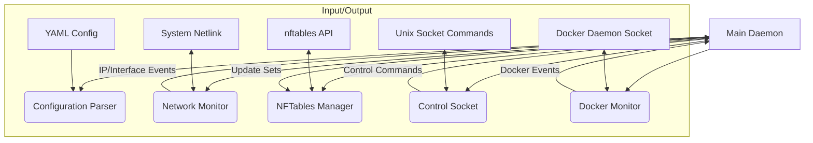

# Packet Router, Network Manager and IP monitor

This document outlines a unified network management service written in Rust. It monitors network interface IP address changes and dynamically updates `nftables` sets accordingly. **Optionally, it can also monitor Docker container lifecycle events and track their IP addresses.** It is designed for Linux systems (Ubuntu/Debian) using `nftables`.

## Prerequisites

*   **Rust Toolchain:** Install Rust (https://rustup.rs/).
*   **nftables:** Ensure `nftables` is installed and running.
    ```bash
    sudo apt update && sudo apt install nftables
    sudo systemctl enable nftables
    sudo systemctl start nftables
    ```
*   **Build Essentials:** Required for compiling dependencies.
```bash
    sudo apt install build-essential pkg-config libmnl-dev
```
*   **(Optional) Docker Socket Access:** For Docker container monitoring, the user running the service needs read access to the Docker daemon socket (typically `/var/run/docker.sock`). This might involve adding the user to the `docker` group.

## Overview and Rationale

The network manager service is responsible for:

*   **Dynamic Monitoring:** Detecting real-time changes to network interfaces and IP addresses using Netlink.
*   **Firewall Coordination:** Automatically updating predefined `nftables` IP sets based on the `nftables_zone` configured for each monitored interface.
*   **Configuration:** Loading interface monitoring configurations from a YAML file.
*   **Control:** Accepting basic commands via a Unix domain socket.
*   **(Optional) Docker Event Monitoring:** Tracking container start/stop events and their associated IP addresses.

This Rust implementation provides memory safety, improved concurrency handling, and maintainability.

## Implementation Details

### Core Components

1.  **Main Daemon (`src/main.rs`):** Central process coordinating all activities, handling signals, and managing the main event loop.
2.  **Configuration Parser (`src/config.rs`):** Handles loading and validating network configuration from `/etc/rust-network-mgr/config.yaml` or a path specified by `RUST_NETWORK_MGR_CONFIG`.
3.  **Network Monitor (`src/network.rs`):** Uses `rtnetlink` to detect IP address and interface changes, emitting events.
4.  **NFTables Manager (`src/nftables.rs`):** Interacts with `nftables` via the `rustables` crate to update IP sets based on network state. Assumes base `nftables` ruleset (specifically table `inet filter`) and the relevant sets (e.g., `wan_ips`, `lan_ips`) are already defined.
5.  **Control Socket (`src/socket.rs`):** Listens on `/run/rust-network-mgr.sock` for commands (`reload`, `status`, `ping`).
6.  **Docker Monitor (`src/docker.rs`):** (Optional) Connects to the Docker daemon socket using the `bollard` crate. Listens for container `start`, `stop`, and `die` events. Inspects started containers to retrieve their IP addresses and updates the application's internal state. Fails gracefully if the Docker socket is inaccessible.



### Core Functional Requirements

1.  **IP Address Monitoring:** Detect interface IP additions/removals via Netlink.
2.  **Atomic NFTables Set Updates:** Reliably update configured `nftables` sets (e.g., `inet filter/wan_ips`) when corresponding interface IPs change. Uses `rustables` for atomic updates.
3.  **Configuration Parsing:** Load interface configurations specifying DHCP status, static addresses (optional), and the target `nftables_zone`.
4.  **Socket Control:** Accept `reload`, `status`, `ping` commands.
5.  **(Optional) Docker IP Tracking:** Maintain an internal map of running container IDs to their discovered IP addresses.

### Example Configuration (`/etc/rust-network-mgr/config.yaml`)

     ```yaml
     interfaces:
  - name: eth0         # Interface name
    dhcp: true         # Monitor DHCP addresses for this interface
    nftables_zone: wan # Maps to nftables set 'wan_ips' in table 'inet filter'
       - name: eth1
    address: 192.168.1.1/24 # Optional static address info (not currently used for monitoring logic)
    nftables_zone: lan # Maps to nftables set 'lan_ips' in table 'inet filter'
# ... other interfaces
```

### NFTables Setup Example

This service *expects* a base `nftables` configuration to exist. It only manages the *elements* within predefined sets.

Example base `/etc/nftables.conf` snippet:

```nftables
table inet filter {
    set wan_ips {
        type ipv4_addr
        flags dynamic
    }
    set lan_ips {
        type ipv4_addr
        flags dynamic
    }

    chain input {
        type filter hook input priority 0; policy accept;

        # Example rule using the set
        ip saddr @wan_ips counter drop
    }

    # ... other chains and rules
}
```

### Directory Structure

```
rust-network-mgr/
├── Cargo.toml
├── src/
│   ├── main.rs
│   ├── network.rs
│   ├── nftables.rs
│   ├── config.rs
│   ├── socket.rs
│   ├── docker.rs  # Docker monitoring module
│   └── types.rs
├── tests/
│   ├── basic_tests.rs
│   └── nftables_manager_tests.rs # Requires root/nftables access
├── pkg-files/
│   ├── systemd/
│   │   └── rust-network-mgr.service # Example systemd unit
│   └── config/
│       └── default.yaml             # Example config
└── README.md
```

### Key Rust Dependencies (Current)

```toml
[dependencies]
# Core Async/Runtime
tokio = { version = "1", features = ["full"] }
futures = "0.3"

# Network Monitoring
rtnetlink = "0.16.0"
netlink-packet-route = "0.22.0"

# NFTables Interaction
rustables = "0.8.6"

# Docker Interaction (Optional Feature)
bollard = "0.15"

# Configuration
serde = { version = "1.0", features = ["derive"] }
serde_yaml = "0.9"
directories = "5.0" # For finding config dirs

# Error Handling & Logging
anyhow = "1.0"
thiserror = "1.0"
log = "0.4"
env_logger = "0.10" # Or tracing/tracing-subscriber

# Utilities
nix = "0.27.1" # For Unix socket permissions
```

*(See `Cargo.toml` for the definitive list)*

### Build, Test, and Run

*   **Build:** `cargo build --release` (Binary at `target/release/rust-network-mgr`)
*   **Test:** `cargo test` (Some tests require `sudo` and `nftables`)
    *   Run ignored tests: `sudo cargo test -- --ignored`
*   **Lint:** `cargo clippy`
*   **Format:** `cargo fmt`
*   **Run:**
    *   Ensure `/etc/rust-network-mgr/config.yaml` exists or set `RUST_NETWORK_MGR_CONFIG`.
    *   **(Docker)** Ensure the service user has permissions for `/var/run/docker.sock` if Docker monitoring is desired.
    *   Run directly (requires privileges for Netlink/nftables/Docker): `sudo target/release/rust-network-mgr`
    *   Use the example systemd service: Copy `pkg-files/systemd/rust-network-mgr.service` to `/etc/systemd/system/`, then `sudo systemctl daemon-reload`, `sudo systemctl start rust-network-mgr`. Check status with `sudo systemctl status rust-network-mgr` and logs with `sudo journalctl -u rust-network-mgr -f`.

### Control Socket Usage

```bash
# Send commands using socat (install if needed: sudo apt install socat)
echo "status" | sudo socat - UNIX-CONNECT:/run/rust-network-mgr.sock
echo "reload" | sudo socat - UNIX-CONNECT:/run/rust-network-mgr.sock
echo "ping"   | sudo socat - UNIX-CONNECT:/run/rust-network-mgr.sock
```

## Development Priorities & Scope

1.  **Reliability:** Ensure correct behavior under various network conditions.
2.  **Correctness:** Accurately update `nftables` sets based on monitored IPs.
3.  **Simplicity:** Maintain a focused scope on coordinating Netlink events with `nftables` set updates. Optional features like Docker monitoring should be self-contained and fail gracefully.
4.  **Testability:** Design components for unit and integration testing.

**Current Scope:** This tool focuses primarily on monitoring interface IPs via Netlink and updating *pre-existing* `nftables` sets based on a simple configuration map (`nftables_zone`). It does *not* manage `nftables` rules, tables, or chains beyond adding/removing IPs from sets. The optional Docker monitoring currently tracks container IPs internally but does not yet integrate them into `nftables` rules.

## Potential Future Features / Roadmap

While the core focus is narrow, future enhancements could include:

*   More sophisticated `nftables` interaction (e.g., managing rules directly).
*   IPv6 support in `nftables` sets.
*   **Docker Integration Enhancements:**
    *   Using discovered container IPs in `nftables` rules/sets (e.g., based on container labels or predefined mappings).
    *   Monitoring Docker network attach/detach events for more granular IP tracking.
*   More detailed status reporting via the control socket (e.g., listing tracked container IPs).

*(These are ideas, not commitments. Development follows the priorities above.)*
