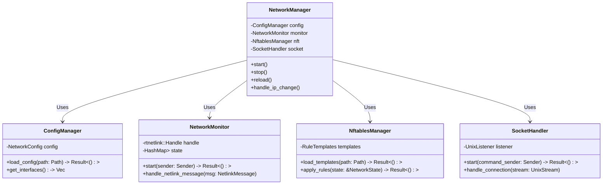

# Packet Router, Network Manager and IP monitor

This document outlines the plan for a new, unified network management service written in Rust. It is designed to replace the existing Node.js (`netmasterplan`) and C++ (`ipmon`) components, providing a more robust, secure, and maintainable foundation for network configuration and firewall coordination within a Linux system (ubuntu/debian).

## Prerequisities
```bash
sudo apt install libnftnl* libmnl* 
```

## Overview and Rationale

The network manager is a critical system component responsible for:

*   **Defining Network State:** Managing configuration for interfaces, IP addressing (static/DHCP), and routing.
*   **Dynamic Monitoring:** Detecting real-time changes to network interfaces and IP addresses (via Netlink).
*   **Firewall Coordination:** Automatically updating `nftables` rules based on network state changes to ensure security policy consistency.
*   **Atomicity:** Guaranteeing that network configuration and firewall rules are updated together to prevent inconsistent states.

Rewriting this service in Rust offers significant advantages in memory safety, concurrency handling, and maintainability compared to the previous C++/Node.js implementation, which is crucial for such a foundational system component.

## Rust Implementation Guide

### Component Overview

The Rust service will consist of four core components:

1. **Main Daemon:** Central process coordinating all activities.
2. **Configuration Parser:** Handles loading and validating network configuration (e.g., YAML).
3. **Network Monitor:** Uses Netlink to detect IP address and interface changes.
4. **NFTables Manager:** Interacts with `nftables` (via `nftnl` or similar) to apply rule updates.


### Core Functional Requirements

1.  **IP Address Monitoring:** Detect interface IP additions/removals (DHCP focus).
2.  **Atomic NFTables Updates:** Reliably update `nftables` rules when IPs change.
3.  **Configuration Parsing:** Load interface configurations from a defined format (e.g., YAML).
4.  **Socket Control:** Accept basic commands (`reload`, `status`) via a Unix socket (e.g., `/run/rust-network-manager.sock`).

### Module Implementation Details

1. **Core Service (`src/main.rs`)**
   * Daemon entry point, main async loop, signal handling.
   * Coordinates other modules.

2. **Network Monitor (`src/network.rs`)**
   * Uses `rtnetlink` to subscribe to network interface/address changes.
   * Tracks current state and emits events on change.

3. **NFTables Management (`src/nftables.rs`)**
   * Loads rule templates.
   * Substitutes dynamic data (like current IPs) into templates.
   * Uses `nftnl` or executes `nft` commands for atomic rule application.

4. **Configuration (`src/config.rs`)**
   * Parses configuration files (e.g., YAML using `serde_yaml`).
   * Validates configuration structure.
   * Provides access to interface settings.
   * **Example `config.yaml`:**
     ```yaml
     interfaces:
       - name: eth0
         dhcp: true
         nftables_zone: wan
       - name: eth1
         address: 192.168.1.1/24
         nftables_zone: lan
     # ... other settings
     ```

5. **Control Socket (`src/socket.rs`)**
   * Listens on a Unix domain socket (using `tokio::net::UnixListener`).
   * Accepts simple text commands.
   * **Supported Commands:**
     * `reload`: Trigger full configuration reload and rule update.
     * `status`: Report basic daemon status and monitored IPs.
     * `ping`: Simple health check.

6. **Types and Utilities (`src/types.rs`)**
   * Shared data structures (e.g., `InterfaceConfig`, `NetworkState`).
   * Custom error types (using `thiserror`).
   * Logging setup (using `tracing`).




### Directory Structure

```
rust-network-manager/
├── Cargo.toml                       # Project dependencies
├── src/                             # All source in a flat structure
│   ├── main.rs                      # Main entry point and daemon
│   ├── network.rs                   # Network monitoring 
│   ├── nftables.rs                  # NFTables management
│   ├── config.rs                    # Configuration handling
│   ├── socket.rs                    # Control socket
│   └── types.rs                     # Shared types and utilities
├── tests/                           # Minimal test suite
│   └── basic_tests.rs               # Core functionality tests
└── pkg-files/                       # Deployment files
    ├── systemd/
    │   └── rust-network-manager.service
    └── config/
        └── default.yaml             # Default configuration
```

### Key Rust Dependencies

```toml
[dependencies]
# Network and system interaction
rtnetlink = "0.13.0"        # Provides safe bindings for Linux Netlink (core for monitoring)
nix = "0.27.1"              # Low-level Unix API access
tokio = { version = "1.32.0", features = ["full"] } # Async runtime

# Configuration
serde = { version = "1.0", features = ["derive"] }
serde_yaml = "0.9.25"       # For parsing YAML configuration files

# NFTables interaction
nftnl = "0.9.0"             # Low-level Netlink bindings specifically for nf_tables (preferred)
# OR consider executing `nft` CLI as a simpler alternative initially

# Error handling and logging
thiserror = "1.0.48"
tracing = "0.1.37"
tracing-subscriber = { version = "0.3.17", features = ["env-filter"] }
```
*Note: Dependency versions are examples and should be kept up-to-date.* 
`nftnl` provides direct Netlink access to `nftables`, offering fine-grained control but with higher complexity. Executing the `nft` command-line tool is simpler but less efficient.

### Development Phases

1. **Phase 1: Core Network Monitoring**
   * Implement `src/network.rs` to detect and log IP changes using `rtnetlink`.
   * Basic daemon structure in `src/main.rs`.

2. **Phase 2: NFTables Integration**
   * Implement `src/nftables.rs` to load templates and apply basic rules (initially via `nft` command execution for simplicity, potentially migrating to `nftnl` later).
   * Connect monitor events to trigger rule updates.

3. **Phase 3: Configuration**
   * Implement `src/config.rs` to parse YAML.
   * Integrate configuration into network monitoring and `nftables` logic.

4. **Phase 4: Control Interface**
   * Implement `src/socket.rs` with `reload` and `status` commands.

### Build and Test

*   **Build:** `cargo build --release`
*   **Test:** `cargo test`
*   **Lint:** `cargo clippy`
*   **Format:** `cargo fmt`

### Implementation Priorities

1. **Safety First:** Prioritize robust error handling and leverage Rust's safety guarantees.
2. **Simplicity:** Start with the simplest implementation that meets core requirements.
3. **Reliability:** Ensure correct behavior under various network conditions (e.g., interface flaps).
4. **Testability:** Design components for unit and integration testing.

## Potential Future Features / Roadmap

The current core functionality focuses on monitoring network interface IP changes and coordinating basic `nftables` updates. Several additional features could be considered for future development, significantly expanding the scope into a broader system monitoring and management tool. Implementing these would require careful design and potentially integrating external libraries or APIs.

*   **Docker Integration:**
    *   **Goal:** Leverage the existing Docker environment (detected running services like `mcp-prompt-manager-py` and `mcp-postgres-server`) for enhanced network awareness and potential coordination.
    *   **Phase 1: Monitoring & Discovery**
        *   Connect to the Docker daemon socket (typically `/var/run/docker.sock`).
        *   Monitor Docker networks (list, inspect) and container lifecycle events (start, stop, die).
        *   Discover container IP addresses dynamically from monitored events or inspection.
    *   **Phase 2: State Integration**
        *   Integrate discovered container IPs into the `NetworkState`.
        *   Potentially tag IPs based on container labels or names.
    *   **Phase 3: NFTables Coordination (Optional/Advanced)**
        *   Allow `nftables` rules to reference Docker container IPs (e.g., by adding them to specific `nftables` sets based on container properties).
    *   **Phase 4: Management (Out of Scope Initially)**
        *   Managing containers/networks (start/stop/create/remove) is complex and overlaps significantly with existing tools (Docker CLI, Portainer). This is likely out of scope for the initial integration.
    *   *Dependencies:* Docker API client library (e.g., `bollard` crate for Rust). Requires access permissions to the Docker socket.
    *   *Complexity:* High. Requires careful handling of the Docker API, event streams, and state synchronization.

*   **Enhanced NFTables Management:**
    *   Provide a full CRUD (Create, Read, Update, Delete) interface for `nftables` rules, sets, and tables.
    *   Implement robust rule generation based on configuration and dynamic state.
    *   Offer features like rule cloning, enabling/disabling.
    *   *Dependencies:* Deeper integration with `nftnl` or a reliable wrapper around the `nft` CLI.
    *   *Complexity:* High. Requires significant effort in `nftables` interaction logic.

*   **Socket and Connection Monitoring:**
    *   List active listening TCP/UDP sockets.
    *   List established connections (local/remote addresses, state).
    *   Potentially identify the process associated with each socket.
    *   Monitor active SSH sessions.
    *   *Dependencies:* Reading `/proc/net/*` files, using `ss` command, or libraries like `netstat2`. Permissions might be required.
    *   *Complexity:* Medium. Overlaps with tools like `ss`, `netstat`, `lsof`.

*   **Port Forwarding Configuration:**
    *   Define and apply port forwarding rules (DNAT/SNAT).
    *   *Dependencies:* Primarily relies on enhanced `nftables` management features.
    *   *Complexity:* Medium (depends on `nftables` implementation).

*   **System Log Monitoring:**
    *   Monitor `journald` for specific system events or service logs.
    *   Monitor `systemd` unit status changes.
    *   *Dependencies:* `journald` client library or D-Bus interaction.
    *   *Complexity:* Medium. Overlaps with `journalctl`, log aggregation systems (Loki, ELK).

*   **Database Monitoring (Clarification Needed):**
    *   Monitoring specific "database actions" is highly application-dependent and likely out of scope for a general network tool.
    *   Monitoring database *service logs* (via `journald`) or *process status* (via `systemd`) might be feasible.
    *   *Complexity:* Very High / Likely Out of Scope (for direct action monitoring).

*   **Graphical User Interface (GUI):**
    *   **Goal:** Provide a visual interface for monitoring network state and managing `nftables`.
    *   **Visualization:** Display network interfaces (status, IPs), discovered networks (e.g., Docker), routing table entries, and `nftables` rules/sets/tables.
    *   **NFTables Management:** Offer a user-friendly way to create, view, edit, and delete `nftables` rules and objects (aligns with "Enhanced NFTables Management").
    *   **Technology Choice:** Requires selecting a Rust GUI toolkit (e.g., `egui`, `iced`, `GTK-rs`, `Slint`, Tauri).
    *   **Architecture:** Could be a separate application communicating with the daemon via its control socket (needs API expansion) or a more integrated component.
    *   *Dependencies:* Chosen GUI toolkit, potentially extended daemon API.
    *   *Complexity:* Very High. Significant UI/UX design and implementation effort.

**Considerations & Scope Management**

Addressing the potential for scope creep and complexity identified in the [Potential Future Features / Roadmap](#potential-future-features--roadmap) is crucial for maintaining a focused and manageable codebase. The following principles will guide future development:

*   **Core Focus:** The primary goal and unique value proposition of this project is the **reliable, atomic coordination between dynamic network interface/IP state (monitored via Netlink) and `nftables` configuration**. All features should ultimately support or enhance this core function. ([Reference: GitHub NBIS Guidelines on documenting purpose](https://github.com/NBISweden/development-guidelines/blob/main/README.md#:~:text=What%20this%20is))
*   **Integration over Replication:** When considering future features (like Docker integration, system log monitoring), the emphasis will be on **integrating** relevant information (e.g., using container IPs in rules) or reacting to external events, rather than replicating the full functionality of existing specialized tools (e.g., Docker CLI, `journalctl`, `ss`). The aim is to leverage other system components effectively.
*   **Modular Implementation:** The architecture (as outlined in [Component Overview](#component-overview)) must remain modular. Future integrations should be implemented as distinct modules (potentially optional or configurable) with clear interfaces, minimizing complexity added to the core daemon loop and facilitating testability.
*   **Strict Prioritization:** New features from the roadmap will be evaluated and prioritized based on:
    1.  Direct relevance and benefit to the core focus (Netlink <-> `nftables` coordination).
    2.  The potential for high-value, low-complexity integrations that enhance the core focus.
    3.  Clear demand and well-defined use cases.
    Features with significant overlap with mature existing tools or those that drastically increase complexity without clear core benefits (e.g., a full GUI, complex application-specific monitoring) will be deprioritized or remain out of scope.
*   **Clear Documentation:** As the project evolves, documentation will clearly delineate the intended scope, functionality, and limitations of each feature, ensuring users understand what the tool does and does not do. ([Reference: Medium Guide on README content](https://medium.com/@kc_clintone/the-ultimate-guide-to-writing-a-great-readme-md-for-your-project-3d49c2023357#:~:text=Provide%20Instructions))

By adhering to these principles, the project aims to deliver robust core functionality while managing complexity and avoiding unnecessary duplication of effort.
